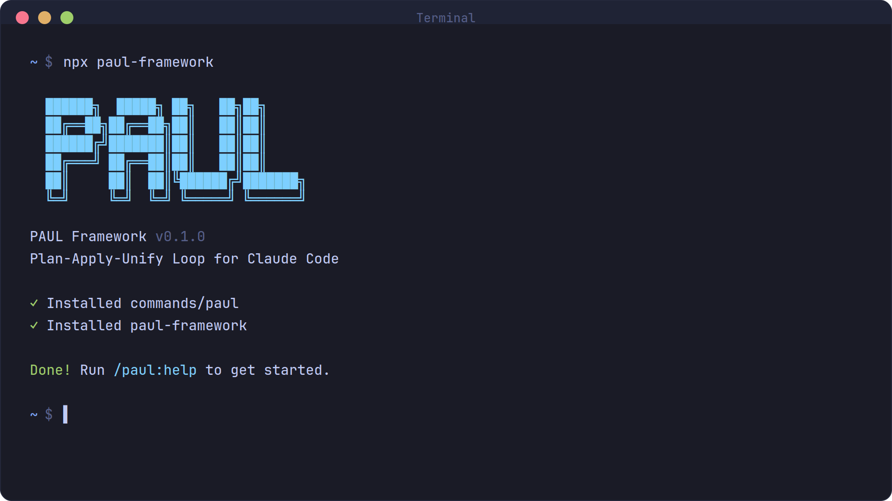

<div align="center">

# PAUL

**Plan-Apply-Unify Loop** — Structured AI-assisted development for Claude Code.

[](https://www.npmjs.com/package/paul-framework)
[](LICENSE)
[](https://github.com/ChristopherKahler/paul)

<br>

```bash
npx paul-framework
```

**Works on Mac, Windows, and Linux.**

<br>



<br>

*"Quality over speed-for-speed's-sake. In-session context over subagent sprawl."*

<br>

[Why PAUL](#why-paul) · [Getting Started](#getting-started) · [The Loop](#the-loop) · [Commands](#commands) · [How It Works](#how-it-works)

</div>

---

## Why PAUL

I build with Claude Code every day. It's incredibly powerful — when you give it the right context.

The problem? **Context rot.** As your session fills up, quality degrades. Subagents spawn with fresh context but return ~70% quality work that needs cleanup. Plans get created but never closed. State drifts. You end up debugging AI output instead of shipping features.

PAUL fixes this with three principles:

1. **Loop integrity** — Every plan closes with UNIFY. No orphan plans. UNIFY reconciles what was planned vs what happened, updates state, logs decisions. This is the heartbeat.

2. **In-session context** — Subagents are expensive and produce lower quality for implementation work. PAUL keeps development in-session with properly managed context. Subagents are reserved for discovery and research — their job IS to gather context.

3. **Acceptance-driven development** — Acceptance criteria are first-class citizens, not afterthoughts. Define done before starting. Every task references its AC. BDD format: `Given [precondition] / When [action] / Then [outcome]`.

The complexity is in the system, not your workflow. Behind the scenes: structured state management, XML task formatting, loop enforcement. What you see: a few commands that keep you on track.

---

## Who This Is For

**Builders who use AI to ship** — software, campaigns, workflows, automations, anything that benefits from structured execution.

PAUL isn't just for code. It manages marketing campaigns, funnel builds, email sequences, and automation workflows with the same rigor it brings to software development.

You describe what you want, Claude Code builds it, and PAUL ensures:
- **Init gathers real requirements** — type-adapted walkthrough produces a populated project brief, not empty placeholders
- Plans have clear acceptance criteria
- **Every task is qualified against the spec** — not just executed and assumed correct
- Execution stays bounded with explicit scope control
- Every unit of work gets closed properly
- State persists across sessions
- Decisions are logged for future reference

No sprint ceremonies. No story points. No enterprise theater. Just a system that keeps AI-assisted development reliable.

---

## Getting Started

```bash
npx paul-framework
```

The installer prompts you to choose:
1. **Location** — Global (all projects) or local (current project only)

Verify with `/paul:help` inside Claude Code.

### Quick Workflow

```bash
# 1. Initialize PAUL in your project
#    Walks through type-adapted requirements (app, campaign, workflow)
#    Produces a populated PROJECT.md — not empty placeholders
/paul:init

# 2. Create a plan for your work
#    Auto-detects scope: quick-fix, standard, or complex
#    Validates coherence against project context before approval
/paul:plan

# 3. Execute the approved plan
#    Each task goes through Execute/Qualify loop
#    Escalation statuses: DONE, DONE_WITH_CONCERNS, NEEDS_CONTEXT, BLOCKED
/paul:apply

# 4. Close the loop (required!)
/paul:unify

# 5. Check progress anytime
/paul:progress
```

### Staying Updated

```bash
npx paul-framework@latest
```

<details>
<summary><strong>Non-interactive Install</strong></summary>

```bash
npx paul-framework --global   # Install to ~/.claude/
npx paul-framework --local    # Install to ./.claude/
```

</details>

---

## The Loop

Every unit of work follows this cycle:

```
┌─────────────────────────────────────┐
│  PLAN ──▶ APPLY ──▶ UNIFY          │
│                                     │
│  Define    Execute    Reconcile     │
│  work      tasks      & close       │
└─────────────────────────────────────┘
```

### PLAN

Create an executable plan with scope-adaptive ceremony:

- **Quick-fix** (1 file, 1 change) — Compressed: objective + 1 task + 1 AC. Full loop, minimal ceremony.
- **Standard** (2-5 tasks) — Full plan with boundaries, multiple ACs, verification checklist.
- **Complex** (6+ tasks) — Full plan + actively recommends splitting.

All plans include:
- **Objective** — What you're building and why
- **Acceptance Criteria** — Given/When/Then definitions of done
- **Tasks** — Specific actions with files, verification, done criteria
- **Boundaries** — What NOT to change (standard/complex only)
- **Coherence validation** — Auto-checked against project context before approval

### APPLY

Execute the approved plan with built-in quality enforcement:
- Tasks follow an **Execute/Qualify loop** — after execution, each task is independently verified against the spec and linked acceptance criteria before moving on
- **Escalation statuses** give nuance beyond pass/fail: DONE, DONE_WITH_CONCERNS, NEEDS_CONTEXT, BLOCKED
- Checkpoints pause for human input when needed — with **diagnostic failure routing** that classifies issues as intent, spec, or code before attempting fixes
- Anti-rationalization enforcement prevents false completion claims

### UNIFY

Close the loop (required!):
- Create SUMMARY.md documenting what was built
- Compare plan vs actual
- Record decisions and deferred issues
- Update STATE.md

**Never skip UNIFY.** Every plan needs closure. This is what separates structured development from chaos.

---

## Commands

PAUL provides 26 commands organized by purpose. Run `/paul:help` for the complete reference.

### Core Loop

| Command | What it does |
|---------|--------------|
| `/paul:init` | Initialize PAUL with type-adapted requirements walkthrough |
| `/paul:plan [phase]` | Create an executable plan (auto-routes quick-fix/standard/complex) |
| `/paul:apply [path]` | Execute an approved plan |
| `/paul:unify [path]` | Reconcile and close the loop |
| `/paul:help` | Show command reference |
| `/paul:status` | Show loop position *(deprecated — use progress)* |

### Session

| Command | What it does |
|---------|--------------|
| `/paul:pause [reason]` | Create handoff for session break |
| `/paul:resume [path]` | Restore context and continue |
| `/paul:progress [context]` | Smart status + ONE next action |
| `/paul:handoff [context]` | Generate comprehensive handoff |

### Roadmap

| Command | What it does |
|---------|--------------|
| `/paul:add-phase <desc>` | Append phase to roadmap |
| `/paul:remove-phase <N>` | Remove future phase |

### Milestone

| Command | What it does |
|---------|--------------|
| `/paul:milestone <name>` | Create new milestone |
| `/paul:complete-milestone` | Archive and tag milestone |
| `/paul:discuss-milestone` | Articulate vision before starting |

### Pre-Planning

| Command | What it does |
|---------|--------------|
| `/paul:discuss <phase>` | Capture decisions before planning |
| `/paul:assumptions <phase>` | See Claude's intended approach |
| `/paul:discover <topic>` | Explore options before planning |
| `/paul:consider-issues` | Triage deferred issues |

### Research

| Command | What it does |
|---------|--------------|
| `/paul:research <topic>` | Deploy research agents |
| `/paul:research-phase <N>` | Research unknowns for a phase |

### Specialized

| Command | What it does |
|---------|--------------|
| `/paul:flows` | Configure skill requirements |
| `/paul:config` | View/modify PAUL settings |
| `/paul:map-codebase` | Generate codebase overview |

### Quality

| Command | What it does |
|---------|--------------|
| `/paul:verify` | Guide manual acceptance testing |
| `/paul:plan-fix` | Plan fixes for UAT issues |

---

## How It Works

### Project Structure

```
.paul/
├── PROJECT.md           # Project context and requirements
├── ROADMAP.md           # Phase breakdown and milestones
├── STATE.md             # Loop position and session state
├── paul.toml            # Machine-readable manifest (BASE-v2 graph integration)
├── ledger.toml          # Session history (cost/time attribution)
├── MILESTONES.md        # Completed milestone log
├── config.md            # Optional integrations
├── SPECIAL-FLOWS.md     # Optional skill requirements
└── phases/
    ├── 01-foundation/
    │   ├── 01-01-PLAN.md
    │   └── 01-01-SUMMARY.md
    └── 02-features/
        ├── 02-01-PLAN.md
        └── 02-01-SUMMARY.md
```

### State Management

**STATE.md** tracks:
- Current phase and plan
- Loop position (PLAN/APPLY/UNIFY markers)
- Session continuity (where you stopped, what's next)
- Accumulated decisions
- Blockers and deferred issues

When you resume work, `/paul:resume` reads STATE.md and suggests exactly ONE next action. No decision fatigue.

### PLAN.md Structure

```markdown
---
phase: 01-foundation
plan: 01
type: execute
autonomous: true
---

<objective>
Goal, Purpose, Output
</objective>

<context>
@-references to relevant files
</context>

<acceptance_criteria>
## AC-1: Feature Works
Given [precondition]
When [action]
Then [outcome]
</acceptance_criteria>

<tasks>
<task type="auto">
  <name>Create login endpoint</name>
  <files>src/api/auth/login.ts</files>
  <action>Implementation details...</action>
  <verify>curl command returns 200</verify>
  <done>AC-1 satisfied</done>
</task>
</tasks>

<boundaries>
## DO NOT CHANGE
- database/migrations/*
- src/lib/auth.ts
</boundaries>
```

Every task has: files, action, verify, done. If you can't specify all four, the task is too vague.

### BASE v2 integration

PAUL works standalone. But paired with **BASE v2** (the proactive context engine), PAUL projects become nodes in a knowledge graph that surfaces the right context at the right time.

When BASE v2 is installed, here's what happens automatically:

- **Session start** - BASE scans all workspaces for `.paul/paul.toml` files and ingests project state into the graph
- **Domain matching** - your project tags connect to BASE domains, so typing "work on casegate" triggers the right rules without you configuring anything
- **Cost attribution** - BASE timestamp-matches your `.paul/ledger.toml` entries against Claude Code session data to show you exactly how much each project, phase, and plan costs in tokens
- **Rule injection** - PAUL-specific rules (loop enforcement, boundary protection, verification requirements) load when you're in a PAUL project and disappear when you're not

Without BASE, PAUL still tracks state, enforces the loop, and manages your plans. With BASE, that state becomes queryable, connected, and visible across your entire workspace.

BASE v2 is a Rust single binary. No MCP server, no wrapper scripts, near-zero standing context cost. `base hook session-start` reads stdin, writes stdout, done.

**Get BASE v2:** [https://chrisai.cv/skool](https://chrisai.cv/skool)

---

## Quality Enforcement

PAUL doesn't just plan and execute — it verifies. These systems work together to catch problems early, before they compound.

### Execute/Qualify Loop

Every task in the APPLY phase goes through an E/Q loop:

```
Execute → Report Status → Qualify Against Spec → (fix gaps) → Next Task
```

The **Qualify** step independently re-reads what was actually produced and compares it against the task spec and acceptance criteria. This catches drift, missing requirements, and false completions that would otherwise pass unnoticed until UNIFY — when it's too late.

### Escalation Statuses

Tasks report one of four statuses instead of binary pass/fail:

| Status | Meaning |
|---|---|
| **DONE** | Completed, no concerns |
| **DONE_WITH_CONCERNS** | Completed, but flagged doubts for review |
| **NEEDS_CONTEXT** | Can't complete — missing information |
| **BLOCKED** | Can't complete — structural impediment |

This surfaces uncertainty honestly instead of silently swallowing it.

### Diagnostic Failure Routing

When a checkpoint fails or UAT finds issues, PAUL classifies the root cause before attempting any fix:

- **Intent issue** — Need to build something different → re-plan the phase
- **Spec issue** — Plan was missing/wrong → fix the spec before patching code
- **Code issue** — Plan was right, code doesn't match → standard fix-in-place

This prevents the common failure mode of patching code when the plan itself was wrong.

### Coherence Check

Before presenting any plan for approval, PAUL automatically validates it against:
- PROJECT.md constraints
- Accumulated decisions in STATE.md
- Files modified in recent plans
- ROADMAP.md phase scope

Issues get flagged before approval. Clean plans pass silently with zero friction.

---

## Philosophy

### Acceptance-Driven Development (A.D.D.)

Acceptance criteria aren't afterthoughts — they're the foundation:

1. **AC defined before tasks** — Know what "done" means
2. **Tasks reference AC** — Every task links to AC-1, AC-2, etc.
3. **Verification required** — Every task needs a verify step
4. **BDD format** — Given/When/Then for testability

### In-Session Context

Why PAUL minimizes subagents for development work:

| Issue | Impact |
|-------|--------|
| Launch cost | 2,000-3,000 tokens to spawn |
| Context gathering | Starts fresh, researches from scratch |
| Resynthesis | Results must be integrated back |
| Quality gap | ~70% compared to in-session work |
| Rework | Subagent output often needs cleanup |

**When PAUL does use subagents:**
- **Discovery/exploration** — Codebase mapping, parallel exploration
- **Research** — Web searches, documentation gathering

For implementation, PAUL keeps everything in-session with proper context management.

### Loop Integrity

The loop isn't optional:

```
PLAN ──▶ APPLY ──▶ UNIFY
  ✓        ✓        ✓     [Loop complete]
```

- **No orphan plans** — Every PLAN gets a SUMMARY
- **State reconciliation** — UNIFY catches drift
- **Decision logging** — Choices are recorded for future sessions

---

## Configuration

### paul.toml (v1.4+)

Every PAUL project generates a `.paul/paul.toml` manifest that BASE v2 reads for graph integration. It tracks project state, milestone progress, loop position, and framework provenance. Workflows update it automatically on every state change. You never edit it by hand.

Alongside it, `.paul/ledger.toml` records a timestamped entry for every PAUL action (plan, apply, unify, etc.) so BASE can attribute token costs to specific projects and phases.

If your project has an older `paul.json`, any PAUL workflow will auto-migrate it to `paul.toml` on contact. No manual steps needed.

### Tags and BASE domains

During `/paul:init`, if BASE v2 is detected, PAUL reads your `domains.toml` and offers domain-based tags. Tags in `paul.toml` become `hasDomain` edges in the graph, meaning BASE automatically injects the right context rules when you work on that project.

### Optional integrations

PAUL supports modular integrations configured in `.paul/config.md`:

| Integration | Purpose |
|-------------|---------|
| SonarQube | Code quality metrics and issues |

### Specialized flows

For projects with specialized requirements, `.paul/SPECIAL-FLOWS.md` defines skills that must be loaded before execution. APPLY blocks until required skills are confirmed loaded.

---

## Troubleshooting

**Commands not found after install?**
- Restart Claude Code to reload slash commands
- Verify files exist in `~/.claude/commands/paul/` (global) or `./.claude/commands/paul/` (local)

**Commands not working as expected?**
- Run `/paul:help` to verify installation
- Re-run `npx paul-framework` to reinstall

**Loop position seems wrong?**
- Check `.paul/STATE.md` for current state
- Run `/paul:progress` for guided next action

**Resuming after a break?**
- Run `/paul:resume` — it reads state and handoffs automatically

---

## Comparison

### vs. Ad-hoc AI Coding

| Ad-hoc | PAUL |
|--------|------|
| No structure | Explicit planning gates |
| State drifts | STATE.md tracks everything |
| No closure | Mandatory UNIFY |
| Decisions lost | Decisions logged |

### vs. GSD

PAUL takes a different approach from GSD:

| Aspect | GSD | PAUL |
|--------|-----|------|
| Execution | Parallel subagents | In-session context |
| Loop | Optional closure | Mandatory UNIFY |
| Criteria | Embedded in tasks | First-class AC section |
| Rules | Static prompts | CARL dynamic loading |

Same coverage, different philosophy. PAUL prioritizes quality over speed-for-speed's-sake.

### vs. Traditional Planning

| Traditional | PAUL |
|-------------|------|
| Documentation-first | Execution-first |
| Human-readable specs | AI-executable prompts |
| Separate from code | Colocated in .paul/ |

---

## Ecosystem

PAUL is part of the Agentic OS by Chris AI Systems. Each piece does one thing well, and they connect through the BASE v2 knowledge graph.

| System | What it does |
|--------|-------------|
| **BASE v2** | Proactive context engine (Rust). Knowledge graph, domain matching, suppression layer, dashboard. The connective tissue. |
| **PAUL** | Project orchestration. Plan, Apply, Unify Loop. You are here. |
| **AEGIS** | Multi-agent codebase auditing. Diagnosis + controlled evolution. |
| **SEED** | Typed project incubator. Guided ideation through graduation into buildable projects. |

| Resource | Link |
|----------|------|
| Community + courses | [https://chrisai.cv/skool](https://chrisai.cv/skool) |
| YouTube | [https://youtube.com/@chris-ai-systems](https://youtube.com/@chris-ai-systems) |

---

## License

MIT License. See [LICENSE](LICENSE) for details.

---

## Author

**Chris Kahler** - [Chris AI Systems](https://chrisai.cv)

Builder and family man who ships systems and shares everything he learns along the way. Work should serve life, not consume it.

- Community: [https://chrisai.cv/skool](https://chrisai.cv/skool)
- YouTube: [https://youtube.com/@chris-ai-systems](https://youtube.com/@chris-ai-systems)
- GitHub: [https://github.com/ChristopherKahler](https://github.com/ChristopherKahler)

---

<div align="center">

**Claude Code is powerful. PAUL keeps it honest.**

*PAUL Framework v1.4 · Chris AI Systems · [https://chrisai.cv/skool](https://chrisai.cv/skool) · [https://youtube.com/@chris-ai-systems](https://youtube.com/@chris-ai-systems)*

</div>
